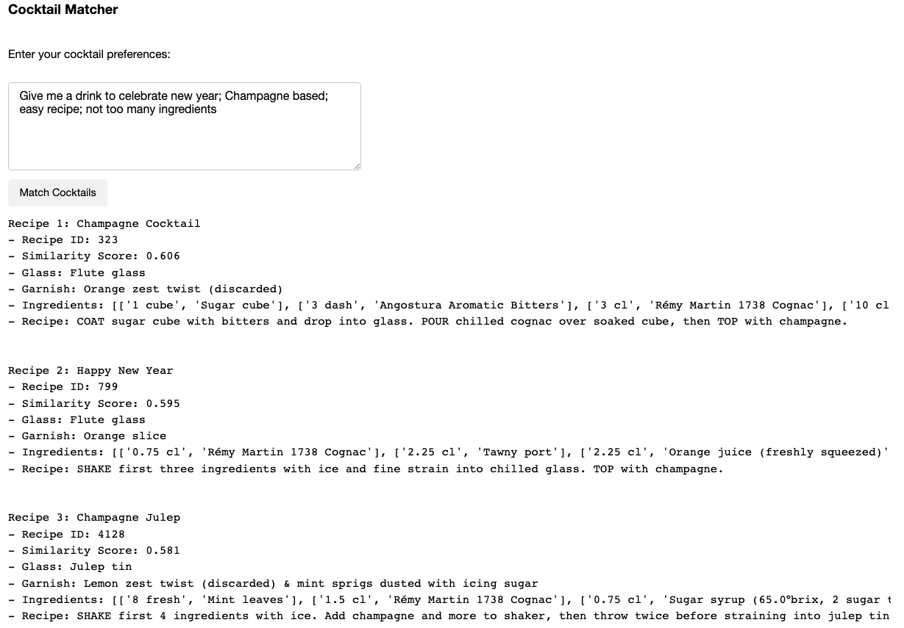

## Not-So-Dry Cocktail Matcher
This demo code helps you find your perfect cocktail recipes in this "not-so-dry" January. It leverages the Huggingface's dataset, [cocktails_recipe_no_brand](https://huggingface.co/datasets/erwanlc/cocktails_recipe_no_brand), which contains 6.6K cocktail recipes. The data fields `title`, `glass`, `garnish`, `recipe`, and `ingredients` are concatenated into `combined_text` and processed using OpenAI's text-embedding-ada-002 to build embeddings. The dataset and precomputed embeddings are stored in Neon's serverless PostgreSQL database.

The script uses function calling to extract desirable cocktail attributes from a given user input. The formated query is constructed by the extract (and enriched) cocktail attribute. The L2 distance was used for the similarity search to find the best-matched cocktail recipes. Note that function calling not only helps structure user input but also enriches it; for instance, if a user asks for "old fashion," the ingredients and recipe are auto-populated by OpenAI's API response.

Below is a simple interface of the Cocktail Matcher.

*Topher said we are taking this little thing to a bar on Feburary 1st.*